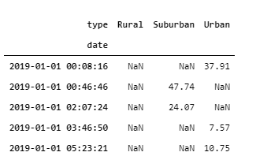
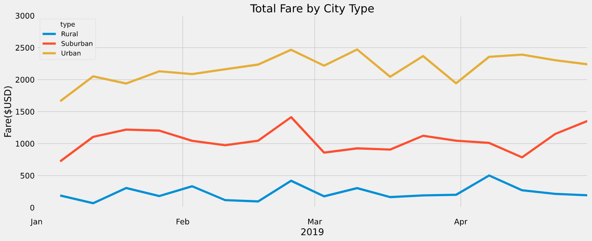
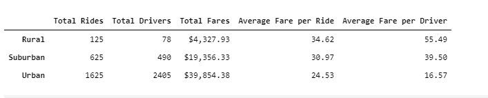

# PyBer_Analysis

## Overview
V. Isualize has given you and Omar a brand-new assignment. Using your Python skills and knowledge of Pandas, you’ll create a summary DataFrame of the ride-sharing data by city type. Then, using Pandas and Matplotlib, you’ll create a multiple-line graph that shows the total weekly fares for each city type. Finally, you’ll submit a written report that summarizes how the data differs by city type and how those differences can be used by decision-makers at PyBer.

## Results
We are going to describe the differences in ride-sharing data among the different city types.
To plot the trend by time we first need to create a dataframe for the sum of fares for each city

Next we create a summary for the type and fare by date

We then pivot the above

Create a subset for timeframe of January to April and convert the index to a datetime

In order to be able to pivot the results for each week we need to convert the index type to datetime
The figure below shows that the index is now in datetime

We then resample the dataframe by week to get the fares by each week

And finally we draw the plot

## Summary
Based on the results, provide three business recommendations to the CEO for addressing any disparities among the city types.
* Rural fares are one eighth of the urban fares
* Suburban fares are half of the ubran fares
The above city types need more attention, possibly by hiring more drivers 
This will also reduce the average fare for a rider and becomes an incentive to increase the number of riders

* The worst period for the fares is between January to mid-February. 
Launching an incentive campaign during this period can attract more riders

